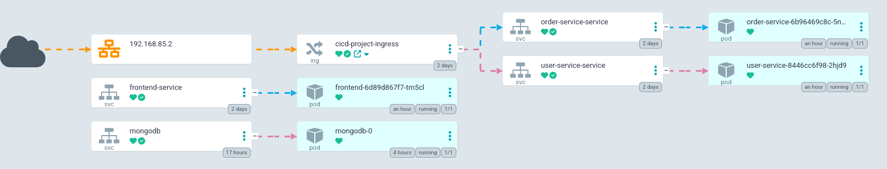

# Projet : Mise en place du CICD dans un environnement Kubernetes pour une application de microservices

## Contexte
Vous travaillez sur le déploiement d'une application composée de microservices dans un environnement Kubernetes. L'application est constituée de quatre services : le frontend React, le service de gestion des ordres, le service utilisateur interagissant avec une base de données MongoDB, et enfin, une instance MongoDB.

## Le projet

- Les microservices : [@matheoleger/cicd-project](https://github.com/matheoleger/cicd-project)
- Les fichiers K8S pour le déploiement : [@matheoleger/microapp-deploy](https://github.com/matheoleger/microapp-deploy)

## Indication sur le projet

### Comment lancer le projet

Afin de lancer le projet en local, j'ai personnellement utilisé `minikube`.

#### Créer le cluster

```bash

minikube start --nodes 3 -p cicd-project

# Si on veut être sûr de l'IP du Cluster et la mettre statique, on peut utiliser :

minikube start --nodes 3 -p cicd-project --static-ip 192.168.85.2

```

Il faut aussi définir le profile de ce cluster par défaut si jamais cela ne s'est pas fait automatiquement :

```bash

minikube profile cicd-project

```

#### Appliquer les différents manifest k8s

Normalement on peut appliquer tous les fichiers qui sont dans le dossier en faisant :

```bash

kubectl apply -f <folder> 

```

Si cela ne fonctionne pas, il faudra appliquer les fichiers un par un :

```bash

kubectl apply -f <file>

```

> :bulb: Il faudra peut-être dans certains cas supprimer les pods, etc... pour mettre à jour les différentes configuration ou réappliquer les différentes fichier.

#### Setup le Ingress

Afin de faire communiquer les 2 services d'API avec l'extérieur du Cluster, j'ai utilisé un Ingress pour que cela marche proprement et simplement.

Tout d'abord, il faut ajouter le `NGINX Ingress Controller` pour pouvoir utilier ce `controller` dans notre object Ingress. 

```bash
kubectl apply -f https://raw.githubusercontent.com/kubernetes/ingress-nginx/controller-0.31.1/deploy/static/provider/baremetal/deploy.yaml

# Si jamais cela ne fonctionne pas, il faut utiliser ceci :

kubectl apply -f https://raw.githubusercontent.com/kubernetes/ingress-nginx/controller-v1.8.2/deploy/static/provider/cloud/deploy.yaml;


```

Si on utilise minikube, on peut avoir besoin aussi d'activer le addons ingress :

```bash
minikube addons enable ingress
```

Maintenant que cela a été fait, on doit ajouter dans le fichier `/etc/hosts` afin de permettre l'ajout d'un nom de domaine que l'on se servira pour l'ingress :

```bash
nano /etc/hosts

# Dans le fichier il faut ajouter cette ligne là :
<IP DU CLUSTER>    api.cicd-project.com

```

Ci-dessus, il faut remplacer `<IP DU CLUSTER>` par l'adresse IP du cluster que l'on peut récupérer (pour minikube) via la commande :

```bash
minikube ip
```

Une fois ceci fait, on peut (au cas où) réappliquer le fichier de ingress :

```bash

kubectl apply -f backend-ingress.yaml # Le path du fichier peut être différent selon le dossier corrant dans le terminal

```

#### Accéder au frontend

```bash
minikube service frontend-service --url
```

#### Mise en place de ArgoCD

J'ai fait fonctionné ArgoCD en local, il faut donc sûrement recréé la configuration de votre côté. Pour ce faire, voici les étapes :

- Créer un namespace pour argocd
   ```bash
   kubectl create namespace argocd
   ```
- Appliquer le manifest d'installation de ArgoCD
   ```bash
   kubectl apply -n argocd -f https://raw.githubusercontent.com/argoproj/argo-cd/stable/manifests/install.yaml
   ```
- Accéder à l'interface de ArgoCD
   ```bash
   kubectl port-forward svc/argocd-server -n argocd 8080:443 
   ```
   On y accède à l’adresse suivante [127.0.0.1:8080](http://127.0.0.1:8080)
- Il faut entrer un `username` et un `password` :

   - `username` ⇒ “admin”
   - `password` ⇒ Pour récupérer le mot de passe par défaut **(en enlevant le pourcentage à la fin)**
       ```bash
       kubectl -n argocd get secret argocd-initial-admin-secret -o jsonpath="{.data.password}" | base64 -d
       ```
- Créer une application `cicd-project`. Voici le `manifest` de l'application :
   ```yaml
   project: default
   source:
      repoURL: 'https://github.com/matheoleger/microapp-deploy.git'
      path: .
      targetRevision: HEAD
   destination:
      server: 'https://kubernetes.default.svc'
      namespace: default
   syncPolicy:
      automated:
         selfHeal: true
   ```

Maintenant vous devriez pouvoir voir quelque chose qui ressemble à ça (en cliquant sur l'affichage `network`):




Maintenant, si jamais il y a une modification dans le code et qu'on créé une nouvelle version du projet, cela déclenchera automatiquement une synchronisation sur ArgoCD.

### À noter

Le repository pour les fichiers de déploiement est disponible à l'adresse suivante : [@matheoleger/microapp-deploy](https://github.com/matheoleger/microapp-deploy)

- Pour Docker
   - Chaque microservices à son `Dockerfile` pour générer une image
   - Chaques images des microservices sont disponible sur [mon profil DockerHub](https://hub.docker.com/u/matheoleger).
   - Il n'y a pas de Dockerfile pour la base de données MongoDB car on peut directement récupérer une image officielle de MongoDB (voir les fichiers manifest de K8S pour la base de données MongoDB)
- Pour Kubernetes
   - Tous les fichiers k8s sont accessible sur le repository [@matheoleger/microapp-deploy](https://github.com/matheoleger/microapp-deploy)
   - La base de donnée est bien un objet `Statefulset` avec un `PersistentVolume`
   - Voici la configuration :
      - Chaques microservices possèdent un fichier `<service>-deployment.yaml` et un `<service>-service.yaml`
      - le service `frontend` est accessible en dehort du cluster via un `NodePort` et accessible au port `31000`.  
        > :bulb: Si vous utilisez `minikube`, vous pouvez récupérer son addresse avec `minikube service frontend-service --url`.
      - `order-service` et `user-service` ont des services de type `ClusterIP` et donc ne sont pas accessible en dehort du cluster.
      - Afin de permettre au `frontend` de faire des requêtes sur les 2 autres services via des requêtes clients, j'ai utilisé un **Ingress Controller** (voir ci-dessus pour la configuration à mettre en place pour le faire fonctionner en local).
      - La base de donnée à un objet service qui permet à la base de donnée d'être accessible seulement à l'intérieur du Cluster et permet donc à `user-service` de se connecter à la BDD.
- Pour ArgoCD
   - Notre application ArgoCD va écouter les changement sur le repo `microapp-deploy` et se synchroniser automatiquement selon les modifications.
- Les différents Github Actions
   - Pour ce repository :
      - J'ai créé plusieurs `jobs` pour le Github Action 
        - Permettant de build les images Docker des différents services et de les push sur les différentes repositories Docker Hub.
        - Un autre job se déclenchant seulement si les 3 images ont bien été build and push. Ce job là permettra de déclencher le Github Action sur le repo `microapp-deploy` en lui donnant la version de l'application (qui correspond à celle des images précédemment build and push).
      - Le Github Action ne se déclenchera seulement lors d'un push sur une branche de version nommé comme ceci `x.x.x` (exemple: `0.6.0`). Ce même nom de branche servira à faire le versionning des images mais aussi de version à envoyer à l'autre Github Action du repository de déploiement.
   - Pour le repository microapp-deploy :
      - Le Github Action sera déclencher lorsqu'il sera triggered par un autre workflow Github Action (donc celui de `cicd-project`)
      - Il va modifier les manifest de déploiements de chaque service afin de modifier le numéro de version des différentes et ainsi permettre de redéclencher une synchronisation pour ArgoCD qui va automatiquement modifier l'application avec les nouvelles images.